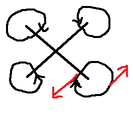

# Rotor torque
A quadcopter can change its yaw by having a different rotational speed between its clockwise and counterclockwise spinning rotors. Each rotor pushes against the air, causing a torque, mainly around the yaw axis. Increasing and decreasing the speed of rotors also changes the drone's rotation, just like a reaction wheel would, but this is generally negligible compared the aforementioned force.

Looking at the image above it should be clear that a rotor applies a force evenly in every direction. Note however the equation for torque:

Where  is the vector from the center of gravity of the drone to the point where the force where  is applied. The force applied further from the center of gravity thus has a larger unfluence on torque, and a rotor rotating at a constant speed will cause a rotational acceleration of the drone.

Questions arrise: How much yaw torque? And: How does this influence pitch and roll if the rotors are placed higher than the center of gravity?

## Math
: force applied by the rotor.

: distance from the center of the rotor to where the force is applied.

: arm from the center of gravity of the drone to the center of the rotor.

\begin{pmatrix}r%5C%5C0%5C%5C0\end{pmatrix})\times(R(\theta)\begin{pmatrix}0%5C%5C0%5C%5CF\end{pmatrix})\delta\theta)

Where R is the rotation matrix of the rotor.

=\begin{pmatrix}\cos(\theta)%260%26\sin{\theta}%5C%5C0%261%260%5C%5C-\sin(\theta)%260%26\cos(\theta)\end{pmatrix})